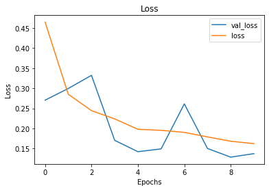
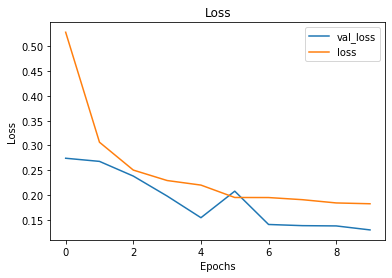

## Introduction
This is a binary image classification project that is taking chest xrays from patients with pneumonia and from healthy patients to see if a neural network can predict if a patient has pneumonia based on their xrays. The dataset comes from https://www.kaggle.com/paultimothymooney/chest-xray-pneumonia

Doctors can determine if a patient has pneumonia from an xray from white splotches being in the chest cavity. By training an AI to diagnose pneumonia this can allow for quicker treatment for patients who're diagnosed with it instead of having to wait for a doctor.

## Data
Example of healthy and sick lungs below here.
Healthy lung

Sick lung

The white splotches are very visible in the sick lung while there aren't any in the healthy one. 

All images are downsized to 75 by 100 pixels, assigned labels for sick or not, and split into training/testing sets.

## Model
The training set is fed into a basic CNN to see what kind of result is gotten. 

First model:
The first model has 1 input layer and 1 output layer. This is not expected to perform very well, and it did not perform very well.

The final model has 1 input layer, 1 output layer, and 3 hidden layers, including a dropout layer. 

Last model

## Conclusion
This model can predict from an xray if a patient has pneumonia or not with about 74% accuracy. This accuracy isn't very convincing, but this is also a very basic model using very low resolution images. Its better than guessing, but an actual doctor will still need to confirm the results. 
